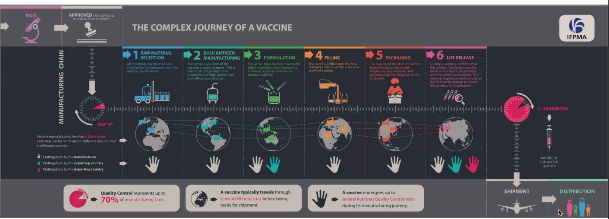

# Vaccine Cold Chain Monitoring

The challenge healthcare industry is facing in very close time is to deliver a billion doses of the vaccine for COVID-19. A vaccine typically travels through multiple sites before being ready for shipment. Multiple companies are involve to manufacture the vaccines. Vaccines need to be handled at an optimal cool temperature (36-46 degrees F) and managed through the cold chain process. Variability in events both internally through the business processes and external events impacting the supply chain across multiple business entities coupled with data residing in multiple clouds presents challenges around anomaly detection that ultimately the vaccin developer is responsible to decision and act on by modifying business processes.
A traditional architecture requires creating new interfaces, integration into systems,  federation and organization of data into a data lake to be ready for any derivation of insights.
Our demonstration today, showcases a developer ready modern architecture comprising of integrated middleware that are used as building blocks to deliver the end to end solution. Use of DevOps tooling and practices accelerates the solution by x factor.

## The IFMA process

